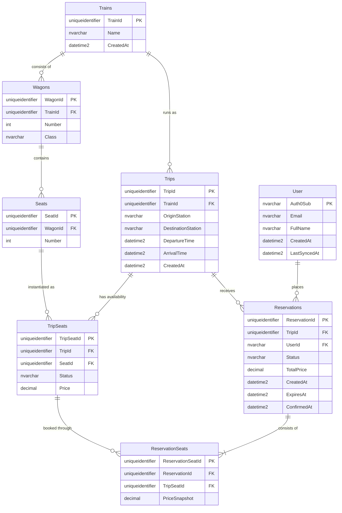

# Database schema

This document describes the persistence model for the Train Seat Reservation API.

The domain is split into two layers:

- **Physical layer** (`Trains`, `Wagons`, `Seats`) — long-lived rolling stock. Rarely changes.
- **Logical layer** (`Trips`, `TripSeats`, `Reservations`, `ReservationSeats`) — per-trip availability and bookings. High write volume.

User identity is delegated to Auth0; the local `User` table is a thin cache.

## Entity-relationship diagram

## Entities

### User

Cached identity information from Auth0. Auth0 remains the source of truth for authentication, email, and profile fields; this table exists so reservation reads don't need to hit the Auth0 Management API on every request.

- `Auth0Sub` — primary key, the Auth0 `sub` claim (e.g. `auth0|6534abc123`). Strings rather than Guids because that's what Auth0 issues.
- `LastSyncedAt` — timestamp of the last refresh from Auth0. Enables a periodic sync job to detect stale entries.

Populated lazily by middleware on the first authenticated request per user (see `README.md` → Auth0 setup).

### Trains

Physical trainsets. One row per named train that exists in the fleet.

### Wagons

Physical wagons (cars) of a train. `Class` here is the classification of the wagon as a whole (`FirstClass`, `SecondClass`, `Bistro`), and seats within a wagon inherit it.

Unique constraint: `(TrainId, Number)` — no two wagons share a number inside the same train.

### Seats

Physical seats inside a wagon. Intentionally minimal: a seat is just a position with a number. Status and price do not live here — they are per-trip (see `TripSeats`).

Unique constraint: `(WagonId, Number)` — no duplicate seat numbers in the same wagon.

### Trips

A specific run of a train on a given date and time. Origin and destination are denormalized as free-text station names for the MVP; a normalized `Routes` / `Stations` model can be added later.

Integrity constraint: `ArrivalTime > DepartureTime` (enforced via `CHECK` constraint in the migration).

### TripSeats

The bridge between physical seats and a specific trip. Each row represents "seat X on trip Y is in state Z at price P."

- `Status` — `Available`, `Reserved`, `Sold`. This is the column targeted by pessimistic locking during reservation.
- `Price` — the price set when the trip was created. Can be adjusted by operators; `ReservationSeats.PriceSnapshot` captures the price at booking time.

Unique constraint: `(TripId, SeatId)` — each physical seat appears exactly once per trip.

See also: `docs/adr/0001-trip-seats-denormalization.md` for why this is a materialized bridge rather than a view or derived state.

### Reservations

A passenger's booking on a trip. A reservation may contain 1–4 trip seats.

- `UserId` — FK to `User.Auth0Sub`.
- `Status` — `Pending`, `Confirmed`, `Cancelled`, `Expired`.
- `ExpiresAt` — set at creation to `CreatedAt + 15 minutes`. The background job queries for `Status = 'Pending' AND ExpiresAt < SYSUTCDATETIME()` to expire stale reservations.
- `ConfirmedAt` — set when the reservation transitions to `Confirmed`. Nullable.
- `TotalPrice` — denormalized sum of `ReservationSeats.PriceSnapshot`. Kept as a domain invariant; verified in unit tests.

### ReservationSeats

Junction between a reservation and the trip seats it holds.

- `PriceSnapshot` — the price at the moment of booking. Insulates the reservation total from later price changes on `TripSeats`.

Unique constraint: `(ReservationId, TripSeatId)` — the same seat cannot appear twice in the same reservation.

## Indexes

Indexes beyond primary keys and uniqueness constraints:

| Index | Purpose |
|---|---|
| `IX_TripSeats_TripId_Status` | Hot-path for `GET /trips/{id}/seats` and target of the pessimistic `SELECT ... WITH (UPDLOCK)` during reservation. |
| `IX_Reservations_UserId_TripId` | "My reservations on this trip" queries, plus the 4-seat-per-trip limit check. |
| `IX_Reservations_Status_ExpiresAt` (filtered: `WHERE Status = 'Pending'`) | Background job that expires pending reservations. Filtered to keep the index small. |

## Seeding rules

When a new `Trip` is created, the application layer generates one `TripSeat` row for each seat of the train's wagons. This is a deliberate denormalization — see ADR-0001.

Seed order matters: insert `Trains` → `Wagons` → `Seats` before any `Trip` is created, since `TripSeats` creation depends on a populated train.

## Notes on concurrency

Seat booking uses pessimistic row-level locking on `TripSeats`. See `README.md` → Concurrency strategy for the full contract (lock hints, isolation level, deterministic lock order, deadlock retry).